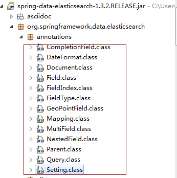

# 使用方法
- - -
## 1. 配置
在application.yml当中配置相关参数
```
spring:
   data:
        elasticsearch:
            #cluster-name: #默认为elasticsearch
            #cluster-nodes: 127.0.0.1: #配置es节点信息，逗号分隔，如果没有指定，则启动ClientNode
            properties:
                path:
                  logs: ./elasticsearch/log #elasticsearch日志存储目录
                  data: ./elasticsearch/data #elasticsearch数据存储目录
```

## 2. 使用方法

```java
//实体类注解

import org.springframework.data.elasticsearch.annotations.Document;

import java.io.Serializable;
import java.util.Date;

/**
 * Created by admin on 17/6/1.
 */
@Document(indexName="projectname",type="article",indexStoreType="fs",shards=5,replicas=1,refreshInterval="-1")
public class Article implements Serializable {
    @Id
    private Long id;
    /**标题*/
    private String title;
    /**摘要*/
    private String abstracts;
    /**内容*/
    private String content;
    /**发表时间*/
    private Date postTime;
    /**点击率*/
    private Long clickCount;
    /**作者*/
    private Author author;
    /**所属教程*/
    private Tutorial tutorial;
 
    //省略get set 方法
}
```
Document注解源码：
```java
/**
* @Document 注解里面的几个属性，类比MySQL的话是这样： 
* index –> DB 
* type –> Table 
* Document –> row 
* @Id 注解加上后，在Elasticsearch里相应于该列就是主键了，在查询时就可以直接用主键查询，后面一篇会讲到。其实和mysql非常类似，基本就是一个数据库。
**/

@Persistent
@Inherited
@Retention(RetentionPolicy.RUNTIME)
@Target({ElementType.TYPE})
public @interface Document {

String indexName();//索引库的名称，个人建议以项目的名称命名

String type() default "";//类型，个人建议以实体的名称命名

short shards() default 5;//默认分区数

short replicas() default 1;//每个分区默认的备份数

String refreshInterval() default "1s";//刷新间隔

String indexStoreType() default "fs";//索引文件存储类型
}

```

加上了@Document注解之后，默认情况下这个实体中所有的属性都会被建立索引、并且分词。 
我们通过@Field注解来进行详细的指定，如果没有特殊需求，那么只需要添加@Document即可。
@Field注解的定义如下：
```java
@Retention(RetentionPolicy.RUNTIME)
@Target(ElementType.FIELD)
@Documented
@Inherited
public @interface Field {

FieldType type() default FieldType.Auto;//自动检测属性的类型

FieldIndex index() default FieldIndex.analyzed;//默认情况下分词

DateFormat format() default DateFormat.none;

String pattern() default "";

boolean store() default false;//默认情况下不存储原文

String searchAnalyzer() default "";//指定字段搜索时使用的分词器

String indexAnalyzer() default "";//指定字段建立索引时指定的分词器

String[] ignoreFields() default {};//如果某个字段需要被忽略

boolean includeInParent() default false;
}
```
其他注解，如下：
 


dao和controller
```java

////泛型的参数分别是实体类型和主键类型
public interface ArticleSearchRepository extends ElasticsearchRepository<Article, Long> {
}


/**
 * Created by admin on 17/6/1.
 */
@RestController
public class TestController {
    @Autowired
    private ArticleSearchRepository articleSearchRepository;

    @RequestMapping("/add")
    public void testSaveArticleIndex() {
        Author author = new Author();
        author.setId(1L);
        author.setName("zhangaolin");
        author.setRemark("java developer");

        Tutorial tutorial = new Tutorial();
        tutorial.setId(1L);
        tutorial.setName("elastic search");

        Article article = new Article();
        article.setId(1L);
        article.setTitle("springboot integreate elasticsearch");
        article.setAbstracts("springboot integreate elasticsearch is very easy");
        article.setTutorial(tutorial);
        article.setAuthor(author);
        article.setContent("elasticsearch based on lucene,"
                + "spring-data-elastichsearch based on elaticsearch"
                + ",this tutorial tell you how to integrete springboot with spring-data-elasticsearch");
        article.setPostTime(new Date());
        article.setClickCount(1L);

        articleSearchRepository.save(article);
    }

    @RequestMapping("/query")
    public void testSearch() {
        String queryString = "springboot";//搜索关键字
        QueryStringQueryBuilder builder = new QueryStringQueryBuilder(queryString);
        Iterable<Article> searchResult = articleSearchRepository.search(builder);
        Iterator<Article> iterator = searchResult.iterator();
        while (iterator.hasNext()) {
            System.out.println(iterator.next());
        }
    }
}

```