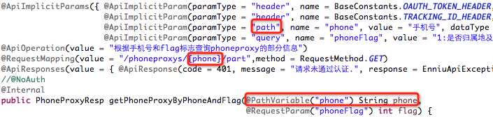

# 使用方法
- - -
## 1. 配置
在application.yml当中配置相关参数
```
swagger2:
  docket:
    basepackage: ##扫描报路径
    paths: ##过滤的路径，支持正则表达式, 可以配置为 /* 
    groupName: ##分组
    pathMapping: ##base，最终调用接口后会和paths拼接在一起, 可以配置为 / 

  apiInfo:
    title: ##大标题
    description:  ##描述
    termsOfServiceUrl:  ##
    contact_name:  ##作者
    contact_url:  ##链接显示文字
    contact_email:  ##邮件地址
    version:  ##版本
```

WebMvcConfigurerAdapter中相关配置
```java
    @Override
	public void addResourceHandlers(ResourceHandlerRegistry registry) {
		registry.addResourceHandler("/swagger-ui.html")
				.addResourceLocations("classpath:/META-INF/resources/");
		registry.addResourceHandler("/webjars/**")
				.addResourceLocations("classpath:/META-INF/resources/webjars/");

	}
```

## 2. 使用方法

```java
@RestController
@RequestMapping("/user")
@Api("userController相关api")
public class UserController {

    @Autowired
    private UserService userService;
    

    @ApiOperation("获取用户信息")
    @ApiImplicitParams({
        @ApiImplicitParam(paramType="header",name="username",dataType="String",required=true,value="用户的姓名",defaultValue="zhaojigang"),
        @ApiImplicitParam(paramType="query",name="password",dataType="String",required=true,value="用户的密码",defaultValue="wangna")
    })
    @ApiResponses({
        @ApiResponse(code=400,message="请求参数没填好"),
        @ApiResponse(code=404,message="请求路径没有或页面跳转路径不对")
    })
    @RequestMapping(value="/getUser",method=RequestMethod.GET)
    public User getUser(@RequestHeader("username") String username, @RequestParam("password") String password) {
        return userService.getUser(username,password);
    }
   
}
```
释:
* @Api：用在类上，说明该类的作用
* @ApiOperation：用在方法上，说明方法的作用
* @ApiImplicitParams：用在方法上包含一组参数说明
* @ApiImplicitParam：用在@ApiImplicitParams注解中，指定一个请求参数的各个方面
* * paramType：参数放在哪个地方
* * * header-->请求参数的获取：@RequestHeader
* * * query-->请求参数的获取：@RequestParam
* * * path（用于restful接口）-->请求参数的获取：@PathVariable
* * * body（不常用）
* * * form（不常用）
* * name：参数名
* * dataType：参数类型
* * required：参数是否必须传
* * value：参数的意思
* * defaultValue：参数的默认值
* @ApiResponses：用于表示一组响应
* @ApiResponse：用在@ApiResponses中，一般用于表达一个错误的响应信息
* * * code：数字，例如400
* * * message：信息，例如"请求参数没填好"
* * * response：抛出异常的类
* @ApiModel：描述一个Model的信息（这种一般用在post创建的时候，使用@RequestBody这样的场景，请求参数无法使用@ApiImplicitParam注解进行描述的时候）
* @ApiModelProperty：描述一个model的属性

需要注意的是：

ApiImplicitParam这个注解不只是注解，还会影响运行期的程序，例子如下：
 
如果ApiImplicitParam中的phone的paramType是query的话，是无法注入到rest路径中的，而且如果是path的话，是不需要配置ApiImplicitParam的，即使配置了，其中的value="手机号"也不会在swagger-ui展示出来。